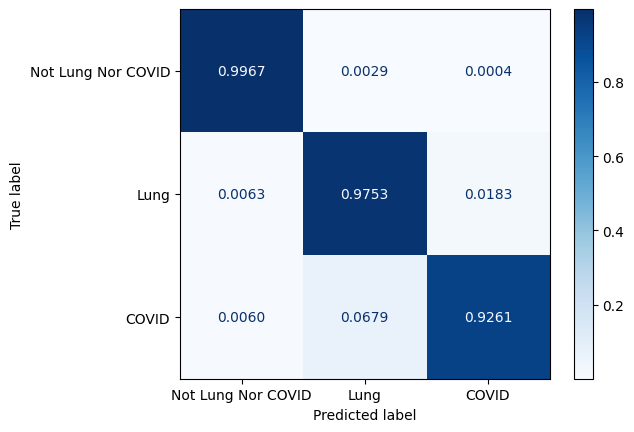

# COVID-19 Segmentation Based on CT images

This is the implementation for the paper.

## Overview

Coronavirus Disease 2019 (COVID-19) pandemic is sweeping fiercely worldwide, causing many enormous negative impacts on human health and economics. According to World Health Organisation (WHO), until April 2021, more than one hundred million cases have been infected and caused 2.8 million deaths in over 200 countries and areas, and these numbers are still increasing. 
Therefore, numerous scientists need great efforts to investigate accurate, efficient diagnoses to prevent the pandemic's infection. Several studies leveraging the great benefits from the rapid development of artificial intelligence proposed several Covid diagnosis methods on lung images with high accuracy. Some affected areas in the lung images can be detected accurately by segmentation methods. This work has considered well-known state-of-the-art Convolutional Neural Network architectures combining the Unet family and Feature Pyramid Network for Covid Segmentation tasks on Computed Tomography Scanner samples from the Italian Society of Medical and Interventional Radiology dataset.
The experiments show that the decoder-based Unet family reaching the best with SE ResNeXt combining Unet++ achieved promising results with a mean Intersection Over Union (mIoU) of 0.9234, 0.9349 in dice score, and a recall of 0.9349. The decoder with the Unet family obtained a better Covid segmentation performance in comparison with Feature Pyramid Network. Furthermore, the proposed method outperforms recent segmentation state-of-the-art approaches such as the SegNet-based network, ADID-UNET, and A-SegNet + FTL. It is expected to provide good segmentation visualizations of medical images for supporting disease diagnosis.

## Dataset
The dataset includes 829 slices belonging to 9 axial volumetric CTs. Furthermore, the experienced radiologist has evaluated, segmented, and marked as COVID-19 on 373 out of the total of 829 slices.

|  Type  | # of samples
|:--------------|---------:|
| Lung Masks |  829   | 
| Infection Masks |  829   | 
| Images |  829  | 
| Infection Masks with COVID-19|  373 | 
||
| Training set |  300   |  
| Testing set |  73  | 

## Experimental Results

The confusion matrix for segmentation model is presented on Figure 1. We also normalize the confusion matrix over rows for analyzing purposes. The confusion matrix values reveal most of the misjudgment of COVID-19 infection regions are categorized as lung and vice versa.

Figure 1. The visualization of confusion matrix for segmentation model

The visualization of several samples with ground-truth and the prediction masks in Figure 2. The lung is colored by slate blue and orange for COVID-19.

Figure 2. The visualization of confusion matrix for segmentation model

